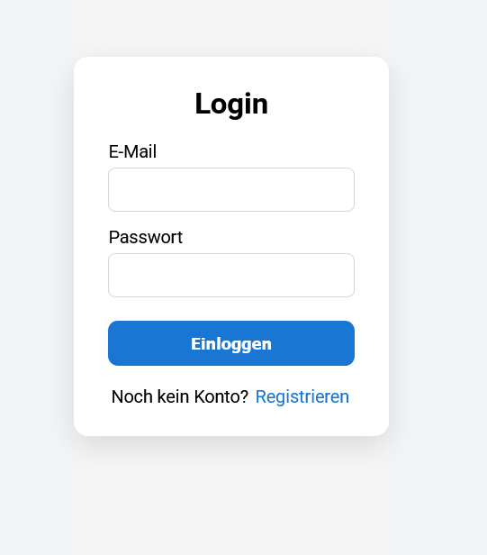
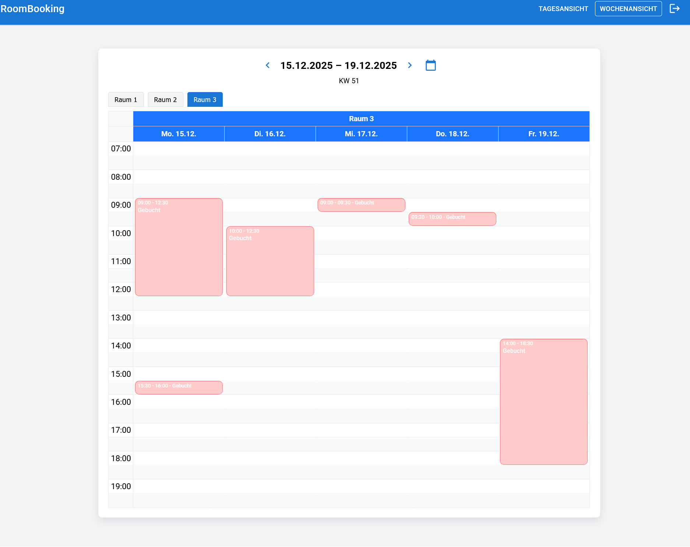
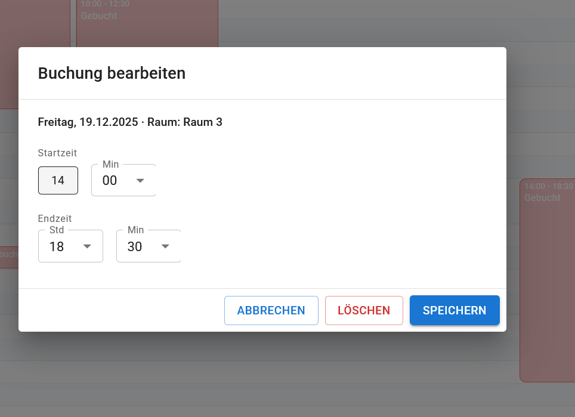

# RoomBooking – Full-Stack Buchungs App 

Eine kompakte Full-Stack-Anwendung zur Registrierung, Anmeldung und Buchung von Terminen in einem Scheduler — mit Fokus auf Clean Architecture.

1. [Über das Projekt](#über-das-projekt)
2. [Features](#features)
3. [Architektur](#architektur)
4. [Technologiestack](#technologiestack)
5. [Quickstart](#quickstart)
6. [Screenshots](#screenshots)
7. [Motivation & Lernziele](-motivation--lernziele)
8. [Autor](#autor)

## Über das Projekt
Ziel der Anwendung ist es, ein einfaches, modernes und intuitives Raum-Buchungssystem bereitzustellen.
- Buchungen erstellen, bearbeiten und löschen
- Nutzer registrieren & authentifizieren
- Kollisionen automatisch prüfen (keine Doppelbuchungen)
- Kalender-Ansicht mit Ressourcen (Räume)

---

## Features
### Raumverwaltung

- Räume anzeigen

### Buchungssystem
- Buchungen für bestimmte Zeiträume erstellen
- Bearbeiten und Löschen eigener Buchungen
- Validierung gegen Überschneidungen
- Tages- und Wochenansicht
- Slot-Auswahl

### Authentifizierung
- Registrierung & Login via JWT
- Sichere Passwort-Hashes
- Zugriffsbeschränkungen für Buchungen

### Frontend
- Ressourcen-Kalender mit FullCalendar Scheduler
- Dynamisches Umschalten zwischen Räumen
- Live-Updates direkt im Kalender
- Responsive UI

---

## Architektur

<p align="center">

</p>

```
RoomBooking.Web                → Controller, Endpoints, Program/DI, DTOs, Mapping
RoomBooking.Application        → Services, Interfaces
RoomBooking.Infrastructure     → EF Core, Identity, DB-Kontext
RoomBooking.Domain             → Domain Modelle
```
Diese Layer-Trennung sorgt für testbaren, erweiterbaren und wartbaren Code.
**Abhängigkeiten zeigen nach innen**

---

## Technologiestack

**Backend**
- C#/.NET 9
- ASP.NET Core Web API
- Entity Framework Core + SqlServer
- ASP.NET Identity + JWT Auth
- Docker & Docker Compose

**Frontend**
- React
- FullCalendar
- MUI Library
- Vite
- Axios

---

## Quickstart

**Projekt klonen**
```
git clone
cd RoomBooking
```

**Backend starten**
```
docker compose up --build
```

**Frontend starten**
```
cd RoomBooking.Frontend
npm install
npm run dev
```

---

## Screenshots










---

## Motivtation & Lernziele

Das Projekt wurde erstellt, um praktische Erfahrung mit Full-Stack Entwicklung zu sammeln:
- Aufbau einer mehrschichtigen Architektur
- Praktische Erfahrung mit Entity Framework Core
- Sicheres User-Management mittels Identity & JWT
- Aufbau eines Raum-Buchungssystems
- Arbeiten mit FullCalendar Scheduler & Ressourcen
- Produktionstauglicher Docker-Workflow

Die Anwendung dient sowohl als Lernprojekt als auch als solide Grundlage für produktive Raum- oder Ressourcenverwaltungssysteme.

---

## Autor

**Name:** Michael Bannach
**Rolle:** angehender Softwareentwickler


---

## Lizenz
Für FullCalendar Scheduler wird der offizielle kostenlose 
„CC-Attribution-NonCommercial-NoDerivatives“-Lizenzschlüssel verwendet.
